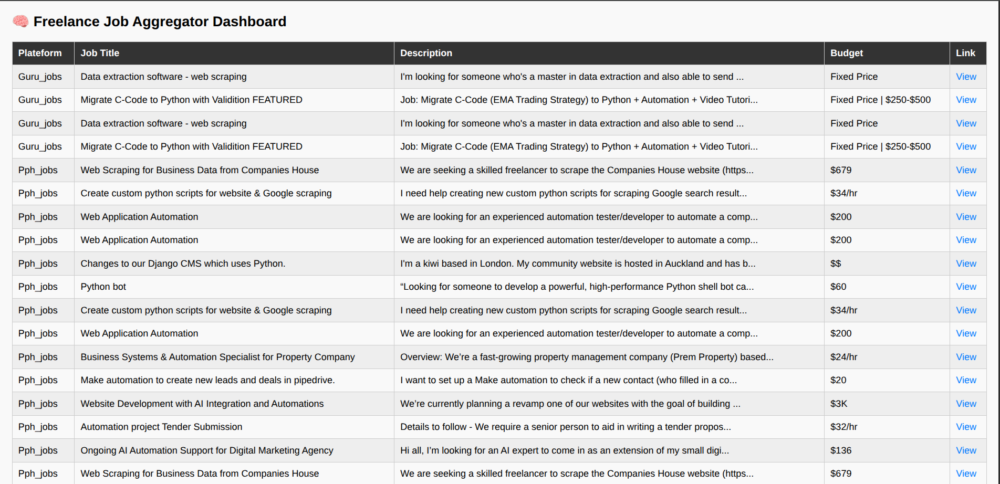

# 🤖 Freelance Job Aggregator Bot

A professional-level Python automation tool that scrapes job listings from multiple freelancing platforms, filters them based on your custom keywords, removes duplicates, logs errors, schedules auto-runs, and displays results on a sleek Flask dashboard.

---
## 📸 Demo Preview



## 🔥 Features

* 🌐 Scrapes from: **PeoplePerHour**, **Guru**, **RemoteOK**
* 🎯 Custom **keyword-based filtering**
* 🧹 **Duplicate job** removal by job link
* 📁 Saves **raw and filtered CSVs**
* 📋 Full **logging system** (errors + actions)
* ⏰ **Automation-ready** using `schedule` or `cron`
* 🧠 Live **Flask dashboard** with Bootstrap
* 🔗 Modular structure — easily extendable

---

## 📁 Project Structure

```
freelance_job_aggregator/
├── scrapers/                  # Platform-specific scraper modules
│   ├── pph_scraper.py
│   ├── guru_scraper.py
│   └── remoteok_scraper.py
│
├── utils/                     # Utility modules
│   ├── helpers.py             # CSV saving helper
│   └── keyword_filter.py      # Pandas-based filtering
│
├── data/                      # Raw and filtered CSV outputs
│   ├── pph_jobs.csv
│   ├── guru_jobs.csv
│   └── ...
│
├── config/                    # Keywords & user preferences
│   └── keywords.txt
│
├── app/                       # Flask app folder
│   ├── dashboard.py           # Dashboard route/controller
│   └── templates/
│       └── index.html         # HTML UI
│
├── main.py                    # Master controller
├── scheduler.py               # Scheduled automation script
├── requirements.txt           # Python dependencies
└── README.md                  # You are here
```

---

## ⚙️ Installation

```bash
# Clone repo
https://github.com/yourusername/Freelance_Job_Aggregator.git
cd Freelance_Job_Aggregator

# Create virtual environment
python3 -m venv venv
source venv/bin/activate

# Install requirements
pip install -r requirements.txt
```

---

## 🚀 Usage

### ▶️ Manual Run

```bash
python main.py
```

This will:

* Scrape from each platform
* Save raw data to `data/`
* Filter using `utils/keyword_filter.py`
* Output filtered results

---

### 🔁 Scheduled Run

```bash
python scheduler.py
```

This will run scraping + filtering at regular intervals.

For Linux automation:

```bash
crontab -e
# Run every 2 hours
0 */2 * * * /path/to/venv/bin/python /full/path/scheduler.py
```

---

### 🧠 Dashboard View

```bash
cd app
python dashboard.py
```

Visit `http://127.0.0.1:5000` to see jobs in browser with Bootstrap design.

---

## 🧪 Output Sample

* `data/pph_jobs.csv` — raw scraped jobs
* `data/filtered_pph_jobs.csv` — filtered relevant jobs
* `logs/errors.log` — if scraping fails or search bar breaks

---

## 🛠 Built With

* **Python 3**
* **Selenium**
* **Pandas**
* **Flask**
* **schedule**
* **Bootstrap** (for dashboard)

---

## 👨‍💻 Author

Made with ❤️ by **Safeer Hussain** — freelance automation enthusiast.

GitHub: [@SyedSafeerHussain](https://github.com/SyedSafeerHussain)

---

## 📜 License

MIT License — feel free to use, modify, and share!
